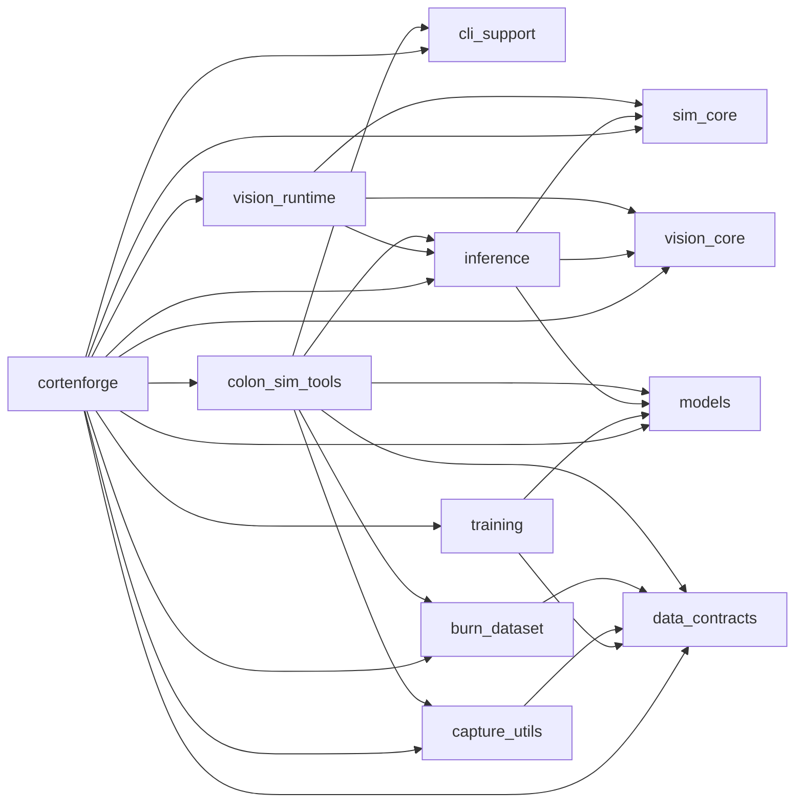

# Dependency Graph

## Interpretation
- Core runtime path: `sim_core` + `vision_core` + `vision_runtime` form the runtime/capture/inference stack; `inference` wires detectors; `models` provides TinyDet/BigDet.
- Data path: `data_contracts` defines schemas; `capture_utils` and tools use them; `burn_dataset` consumes schemas for Burn loaders.
- Training path: `training` depends on `models` and `data_contracts` to produce checkpoints; `inference` consumes them.
- Tooling: `colon_sim_tools` wraps CLI helpers (`cli_support`), recorder/capture (`capture_utils`), schemas (`data_contracts`), dataset (`burn_dataset`), and inference/models.
- Umbrella: `cortenforge` re-exports the stack with feature wiring.
