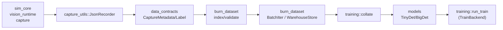

# Flow: Capture → Warehouse → Training

Traces how a captured run becomes training batches and a checkpoint. Emphasizes crate boundaries, data handoffs, and failure surfaces.

## Overview diagram

## Step-by-step
1) **Capture & record**  
   - Owner: `sim_core` + `vision_runtime::CapturePlugin`.  
   - Data: `vision_core::Frame` → `FrameRecord`.  
   - Sink: `capture_utils::JsonRecorder` writes `CaptureMetadata` JSON + images. Errors: IO/validation (bubbles as `io::Error`); missing images fail the record.

2) **Overlay (optional)**  
   - Owner: `capture_utils::generate_overlays` using `vision_core::overlay`.  
   - Data: label JSON + images → overlay PNG. Errors are mostly skipped/logged; missing files silently drop overlays.

3) **Index & validate**  
   - Owner: `burn_dataset::index_runs` / `summarize_with_thresholds`.  
   - Data: run dir → `SampleIndex` list + `ValidationReport`. Errors: IO/serde; validation marks missing/invalid/empty counts. Env thresholds (`BURN_DATASET_MAX_*`) determine pass/warn/fail.

4) **Batch iteration / warehouse**  
   - Owner: `burn_dataset::BatchIter` or `Warehouse*` loaders (in-memory/streaming).  
   - Data: labels/images → augmented tensors (`BurnBatch`). Errors: missing images, invalid labels → `BurnDatasetError`; permissive mode may skip with logs. Assumes consistent image sizes unless `target_size` set.

5) **Collate & features**  
   - Owner: `training::collate`.  
   - Data: `RunSample` slice → `CollatedBatch` (images/boxes/mask/features). Errors: empty batch, mixed dimensions, image IO.

6) **Model forward & train loop**  
   - Owner: `training::run_train` (CLI) with `models::TinyDet/BigDet` on `TrainBackend` (NdArray or WGPU).  
   - Data: batches → logits/loss → optimizer updates. Errors: backend/runtime errors surface via anyhow; model assumes normalized inputs.

7) **Checkpoint output**  
   - Owner: training bin + Burn recorder (outside this crate).  
   - Data: trained weights saved for downstream `inference::InferenceFactory` consumption.

## Failure points & handling
Quick reference for where this flow can fail and how to respond.
| Stage | Failure mode | Handling |
| --- | --- | --- |
| Recorder | IO/validation failure aborts that frame write. | Upstream should log and decide to retry or skip. |
| Validation | Thresholds exceeded can fail the run. | Adjust thresholds or fix source data. |
| BatchIter | Shape mismatches or persistent IO errors. | Fatal unless permissive skip is enabled. |
| Collate | Mixed image sizes error out. | Preprocess or set `target_size` in dataset config. |
| Training | Backend/runtime errors (e.g., GPU driver). | Bubble via anyhow; no retries built in. |

## Notes
- Default pipeline is CPU (NdArray); enable `backend-wgpu` features for GPU in training and models.
- `max_boxes` choices must be aligned across burn_dataset, training, and models to avoid shape mismatch.
